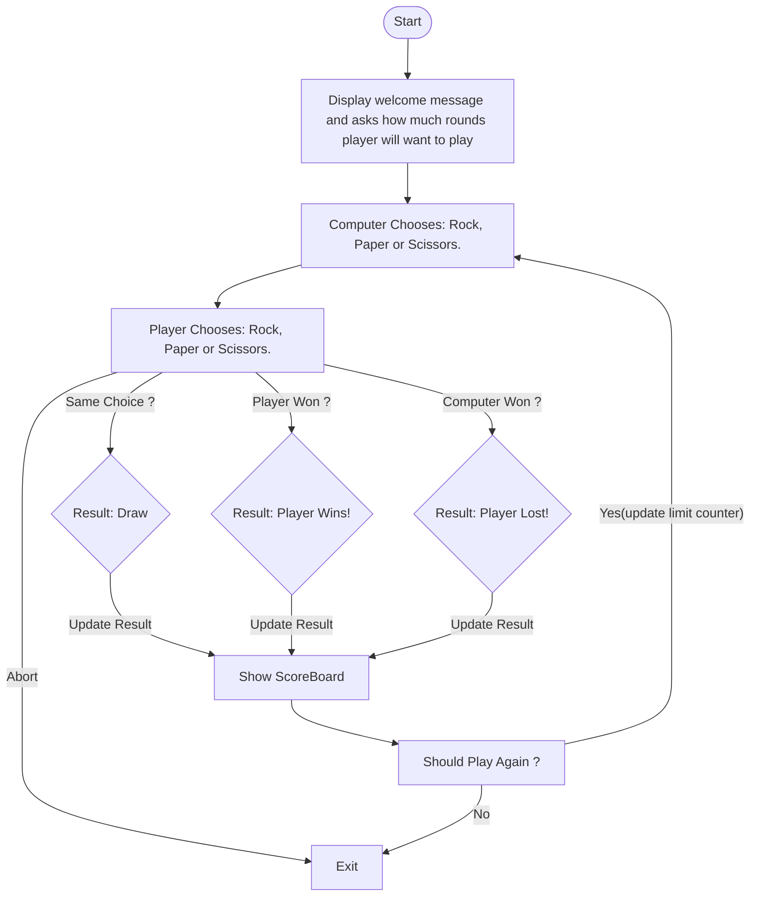

# RockPaperScissor
This repository is a simple JS script to perform the Rock Paper Scissor game. Fistly from Console, but this code might receive future upgrades to a GUI Interface so far. 

# Preambule
This documentation has been written to document the development of Rock-Paper-Scissors exercise from The Odin Project. This has been started from the beginning of the code (even before the first line written) to exercise Product Requirements as well. The idea behind it is to deliver a full website of Rock-Paper-Scissors games on the internet.

This prototype will start with a game being done through console logs and should be upgraded to GUI(Graphics User Interface) in the future.

Authorship:
[https://github.com/NaderHauache](https://github.com/NaderHauache) (Programmer)
[https://github.com/robertosuelen](https://github.com/robertosuelen) (Project Manager/Product Owner/QA Consultant)

# Scope
The software will be developed into a MVP(Minimal Value Product) only working on the console at the first moment. Later versions should include a GUI running directly from Browser. It’s just an exercise about R.P.S game to understand better JS scripts.&nbsp;

# Game Rules
1) Player 1(Machine) and Player 2(Human) must choose: Rock, Paper or Scissor.  
2) A comparison is done with the choice of P1 and P2.  
   1) A point is given to the round winner.  
   2) None point is given to a tied game. 
3) Score Rules:  
   1) Rock  
      1) Wins against Scissor  
      2) Lose against Paper  
   2) Paper  
      1) Wins against Rock  
      2) Lose against Paper  
   3) Scissor  
      1) Wins against Paper  
      2) Lose against Rock  
   4) If both players choose the same option, the round is tied.  
4) Winner Definition(end game):  
   1) The player with the bigger scoreboard will win.  
   2) If P1 == P2, the game finished tied.

# Application Requirements
These are the application requirements to describe what will be the functional requirements of application:

1) User will play against the machine;  
2) User will play against the machine 5 turns;  
3) User will need to choose Rock(0), Paper(1) or Scissor(2) option;  
4) Machine will pick one also randomly;  
   1) The seed must be reseted each round;  
   2) The machine must choose the option before the user.  
5) ScoreBoard must be informed to the user all the time while game is running;  
6) In the end of the game, the result must be informed as well.

# Logical Game Fluxogram

# JS Functions
Some functions will be described here. Here are the rules to write functions:

* A function must perform only one action.  
* Function names must be clear to the reader.

|    Function Name    |          Returns            |                                   Description                                    |
| :-----------------: | :------------------------:  | :------------------------------------------------------------------------------: |
| pickRandomNumber()  |     An integer: \[0,3)      | Return a random number in the interval to provide a choice to the machine.&nbsp; |
| getComputerChoice() |     An integer: \[0,3)      |                  Abstracts how the computer will play the turn.                  |
|  getHumanChoice()   |     An integer: \[0,3)      |                   Ask the user which will be the right choice.                   |
|    humanScore()     |    An integer: \[0,15\]     |               Returns the human score stored in a local variable.                |
|   computerScore()   |    An integer: \[0,15\]     |              Returns the computer score stored in a local variable.              |
|  showScoreboard()   | A String: \`${HS} x ${CS}\` |                  Returns a String to be printed on the console.                  |
|     playRound()     |     A number: 0(draw) - 1(human) - 2(computer)       |                 Plays a round with both players. Informs the round winner.                           |
|     playGame()      |            void             |     Structures the logic of game loop     |
|     abortGame(currentTurn, TotalTurn)     |          Boolean           |         Asks if user wants to abort game.&nbsp;          |
|     toInt(number)   |          A number           |         Provides a cast using bitwise operations as a trick to avoid callings to other functions. &nbsp;          |